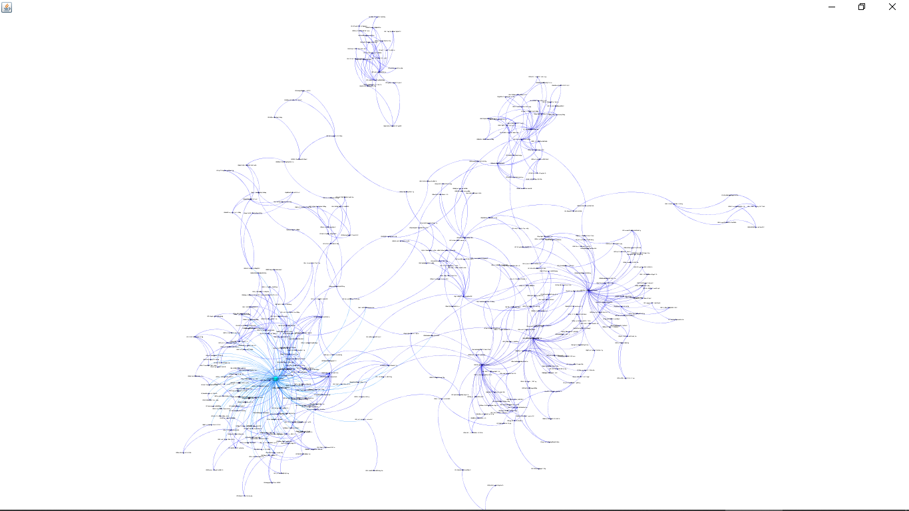
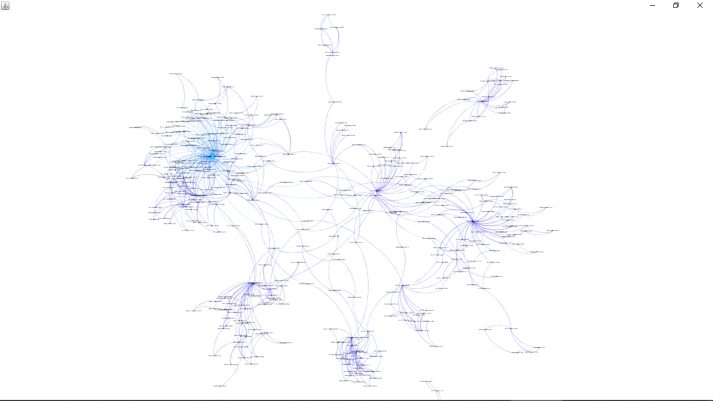
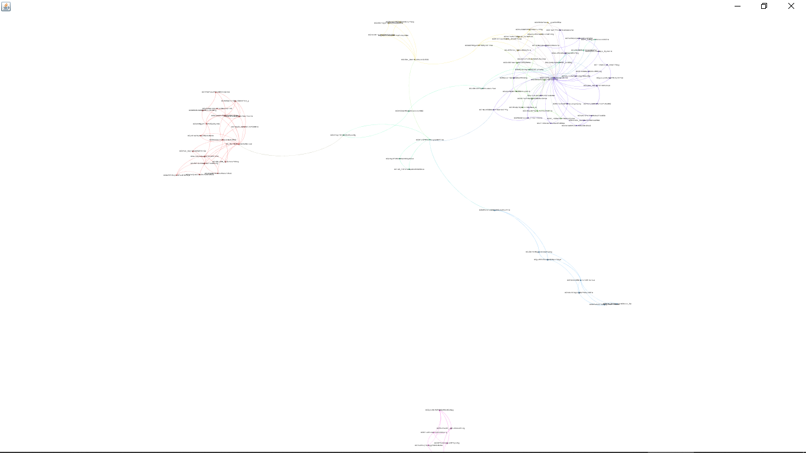
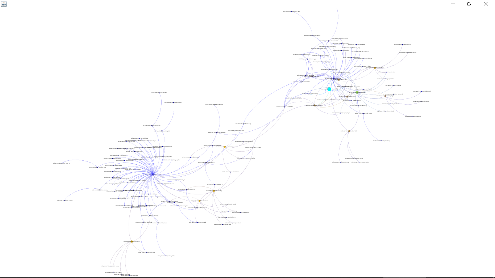
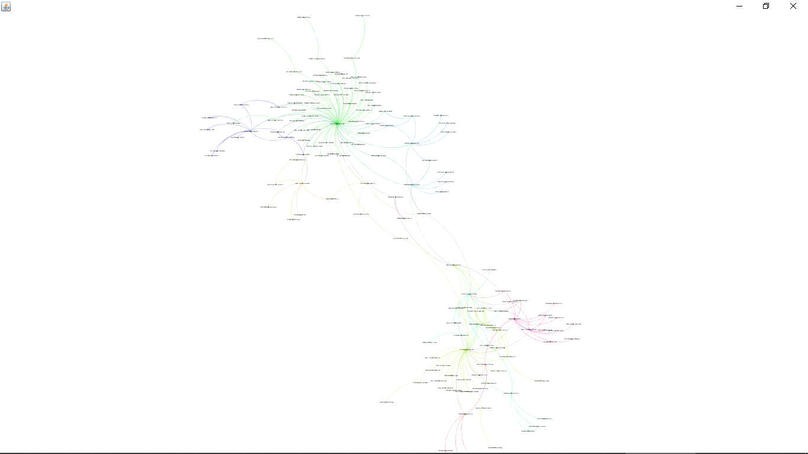

# Проект по дипломной работе
  Проект посвящен анализу AD HOC дискусский в социальной сети Youtube  
    Язык программирования: Java   
    Используемые библиотеки: Gson, YouTube Data API, Gephi Toolkit, SaX,XmlPull  
    База данных: Postgres
  
  На данный момент реализован сбор данных по каждому видео в ютуб по введенному запросу, построение и отображение графа, где вершины - пользователи, ребра - наличие взаимодействия между пользователями(по комментариям)
  ## Визуализация (k=миним степень вершин,v=количество видео)
  ### PageRank, k=2, v=18
  
  ### Betweeness centrality, k=2, v=18
   
  ### Modularity, k=3, v=19
   
  ### Betweeness centrality, k=1, v=2
   
   ### Modularity, k=1, v=2
   
## Сборка проекта
